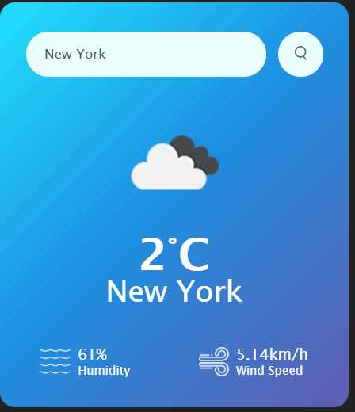

# Weather-App-JS

I have created this Weather App using Open Weather MAP weather API and it uses following features:

1. It asks for permission to get user's location, if successful it shows weather details of current location or if fails it displays weather conditions of New York.
2. Users can enter city of any location and it displays weather details of the that city.

It uses following JS features:
- geolocation API
- async/await promise
- fetch API
- DOM manipulation
- and others...

Here are application screenshots:

Feel free to use it for learning and don't forget to give it star or fork it. Thanks.
